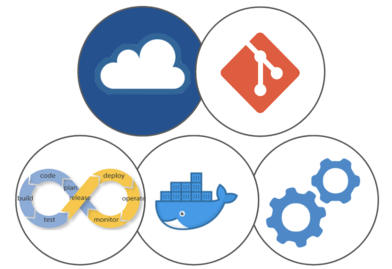

# DevOps Course

## Office Hours

* [Schedule a Conversation](email.png)

## Links

* [A] [LinkedIn Profile](https://www.linkedin.com/in/uhitzel/)
* [B] [DevOps Telegram Channel](https://t.me/devopsupdates)
* [C] [Qwiklabs Sign Up](https://bit.ly/free-qwiklabs2020)
* [D] [Google Cloud Console](https://console.cloud.google.com/)
* [E] [Google Cloud Shell](https://console.cloud.google.com/home/dashboard?cloudshell=true)
* [F] [Google Cloud Shell with Editor](https://ssh.cloud.google.com/cloudshell/editor?hl=en_GB&fromcloudshell=true)
* [G] [MongoDB Cloud](https://www.mongodb.com/cloud/atlas/lp/try2)

## Exercises

* [1] [Google Qwiklabs](https://www.qwiklabs.com/)
* [2] Google Cloud Essentials:
    * [3] [Enroll in the 'Quest'](https://google.qwiklabs.com/quests/23)
    * [4] - [Create Virtual Machine](https://google.qwiklabs.com/focuses/3563?parent=catalog)
    * [5] - [Deploy on Kubernetes](https://google.qwiklabs.com/focuses/878?parent=catalog)
* [6] [MongoDB Getting Started](https://github.com/u1i/mongodb-getting-started)
* [7] [Docker Hello](https://github.com/u1i/docker-hello)
* [8] [NodeJS API in Docker](https://github.com/u1i/nodejs-api)
* [9] [GitHub Actions Example](https://github.com/u1i/ghactions-test)
* [10] [ARM Templates](https://github.com/u1i/azure-arm
)
* [11] [Ansible Exercise](https://github.com/u1i/ansible-exercise)
* [12] [GCP Deployment Manager](https://google.qwiklabs.com/focuses/863?parent=catalog)
* [13] [Try Azure App Service](https://azure.microsoft.com/en-us/try/app-service/)
* [14] [Netlify CMS](https://github.com/u1i/gatsby-starter-netlify-cms)
* [15] [k3s Exercise](https://github.com/u1i/k3s-quickstart)
* [16] [Docker Hello – Auto Build](https://github.com/u1i/docker-hello-autobuild)
* [17] [Kubernetes in Google Cloud Shell](https://shell.cloud.google.com/?walkthrough_tutorial_url=https%3A%2F%2Fwalkthroughs.googleusercontent.com%2Fcontent%2Fgke_cloud_code_create_app%2Fgke_cloud_code_create_app.md&show=ide&environment_deployment=ide)
* [18] [scrumblr](https://github.com/aliasaria/scrumblr) | [Containerized Version](https://github.com/u1i/scrumblr-docker)

## Course Outline & Suggested Material for Preparation

In this course, we look at the architecture and building blocks of modern, distributed systems, and introduce the core concepts of DevOps including people, tools, and processes. Students will learn about iterative release management, pipelines, CI/CD, version control systems, containerization, configuration management, infrastructure-as-code and gain hands-on experience with Git, Docker, Kubernetes, CI/CD frameworks, and the cloud.

At the end of the course, participants will be able to:

* Architect modern distributed systems
* Understand DevOps concepts: people, tools, processes
* Gain hands-on knowledge: distributed version control with Git
* Provision and work with cloud computing resources
* Understand and apply agile project management methods such as Agile and Scrum
* Pipelines, containerization of code, orchestration of containers with Kubernetes
* Infrastructure-as-Code and automation

### Day 1 (half day)

* Modern Application Design – The Big Picture
* Why DevOps?
* Cloud Computing
* Git

#### Videos

* [What is DevOps? (2 min)](https://www.youtube.com/watch?v=aFWi8ToAjpU)
* [Cloud Computing Defined (2 min)](https://www.youtube.com/watch?v=ZnGzxV_dQeg)
* [What is Git? (2 min)](https://www.youtube.com/watch?v=2ReR1YJrNOM)

#### Material

* [Cloud Computing Explained (ZDNet)](https://www.zdnet.com/article/what-is-cloud-computing-everything-you-need-to-know-about-the-cloud/)
* [What is Git & How to Use It](https://www.freecodecamp.org/news/what-is-git-and-how-to-use-it-c341b049ae61/)
* [GitHub First Steps](https://guides.github.com/activities/hello-world/) | [Git Guide](https://rogerdudler.github.io/git-guide/)

### Day 2 (Full Day)

* Recap: The Need for DevOps, Cloud Computing, Git
* CI/CD, Pipelines
* Kanban, Agile & Scrum
* Containers & Kubernetes
* Automation & Infrastructure-as-Code

#### Videos

* [CI/CD Explained in 100 Seconds (2 min)](https://www.youtube.com/watch?v=scEDHsr3APg)
* [Scrum 7 min explainer video](https://www.youtube.com/watch?v=9TycLR0TqFA)
* [Docker in 100 Seconds](https://www.youtube.com/watch?v=Gjnup-PuquQ)
* [Kubernetes in 100 Seconds](https://www.youtube.com/watch?v=PziYflu8cB8)
* [Infrastructure-as-Code (3 min)](https://www.youtube.com/watch?v=RO7VcUAsf-I)

#### Material

* [DevOps Basics](https://ddls.com.ph/wp-content/uploads/2018/05/devops-the-basics-v1-r1.0.pdf)
* [What is CI/CD?](https://circleci.com/continuous-integration/)
* [What's Agile & Scrum?](https://www.cprime.com/resources/what-is-agile-what-is-scrum/)
* [Docker Introduction](https://medium.com/zero-equals-false/docker-introduction-what-you-need-to-know-to-start-creating-containers-8ffaf064930a)
* [What's GitHub Actions?](https://itnext.io/getting-started-with-github-actions-fe94167dbc6d)
* [Learn Git Branching](https://learngitbranching.js.org/)

### Day 3 (Show & Tell)

The stage is yours!

* Projects – choose one of the following
    * (1) [BCM Pte Ltd.](./projects/bcm.md) --> your deliverable is a slide deck
    * (2) [CI/CD](./projects/tech.md ) --> your deliverable is a GitHub repository with code & descriptions. No slides!

* One project per student, no group work

	* The descriptions are vague on purpose and meant to inspire your creativity & give you freedom to build a project based on your ideas, interest, and level of technical debt.
	* Try your best not to think of the project as 'homework submission', but your chance to apply what you learned
	* For the BCM project: assume you're speaking to an executive panel (the customer) in that session
	* For the technical project: much more important than actual coding miracles is clearly showing & illustrating what you are trying to achieve, which steps you take, and what the desired outcome is (README.md). If you can make automated (parts!) of the CI/CD workflow happen, even better! Clone and adapt some of the examples from the course to get you started!

* Submit into the 'Show and Tell' folder in LumiNUS by 8pm the night before the session:
	* a slide deck (PDF) – if you chose project (1)
	* a text file that contains your name + a link to a public GitHub repo – if you chose project (2)
* Get ready to present at the Show & Tell! In the interest of time we will use ONE laptop where we run all slides & projects from
* Attendance is compulsory. If you have a valid reason why you are not able to join the Show & Tell session, you are expected to record a short video (max 5 minutes) where you:
	* assume you're speaking to an executive panel (the customer) – if you chose project (1)
	* show what you built & talk about your approach – if you chose project (2)
	* how to record such a video? Get on a Zoom call with yourself, press record, share the screen and you're in business. After that, upload the file to LumiNUS.

## Tools & References

* [Scrumblr – simple Kanban board](http://scrumblr.ca/)
* [Flyin Donut – free scrumban tool](https://www.flyingdonut.io/)
* [Markdown Cheat Sheet](https://github.com/adam-p/markdown-here/wiki/Markdown-Cheatsheet)
* [MongoDB 5 min explainer video](https://www.youtube.com/watch?v=EE8ZTQxa0AM)

## Other Material & Links

* [What is Ethereum? A Beginner's Explanation in Plain English
 (11 min)](https://www.youtube.com/watch?v=jxLkbJozKbY)
* [Blockchain 101 Visual Demo](https://www.youtube.com/watch?v=_160oMzblY8)
* [Free Subdomains for your GitHub Pages etc](https://freedns.afraid.org/)
* [Using Git with VS Code](https://code.visualstudio.com/docs/editor/versioncontrol)
* [AI research – GPT-3](https://apigeek.net/#openai--gpt-3)
