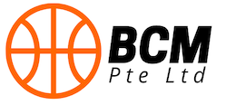

# Project 1: BCM Pte Ltd

## Your Task

Create a short presentation deck for the executive team of BCM Pte Ltd.

This (fictional) company offers a service that is used by ~200,000 people in Singapore, mostly through a mobile app.

BCM Pte Ltd is planning to expand into other countries in South East Asia and is looking for a strategy to release product updates faster, currently a new version takes around 3 months to ship. At the same time, users have started complaining about the poor service of the mobile app which causes a lot of frustration. Facing strong competition in the market, the management team have realized they need to address this quickly.

You have recently joined a consultancy firm that helps companies with digital transformation – people, tools, and processes. After an initial discovery workshop conducted last month you are now presenting your first set of recommendations to the executive team:

* Simon Quek, CEO – founded the company 7 years ago after spending 20 years in finance. He loved the brand that he built, but needs to find a way to align the priorities in his team and bring in fresh ideas
* Edmund Toh, Head of IT & Operations – an IT veteran and proud technologist who still keeps his SQL expertise current. When the company launched it was him who installed the first web server in their Jurong data center, and he will tell you in the meeting that this server is still working and going strong!
* Carol Ong, Head of Product and Interim Head of Engineering – joined the company recently after two departures in the leadership team. Carol worked for several technology vendors before and brings in vast experience, but she needs to deliver results soon
* Jayson Lim, Lead Developer – principal engineer on the team, building backend and frontend code. He is looking to help train some of the more junior people on the team, but unfortunately, Jayson frequently gets pulled into troubleshooting production outages and that really is something only he can do

## Tips & Guidelines 

* What service exactly does BCM Pte Ltd offer to end users? Expense / insurance claims, tuition bookings, food delivery? Choose one of these or come up with your own idea
* Give a couple of recommendations on modern technology components that the company could use and explain why
* The people & processes part is very important
* Make assumptions about the things you learned about the company in the discovery workshop. Current IT setup, teams, programming languages, databases etc.
* Your deck should have a maximum of 8 slides

